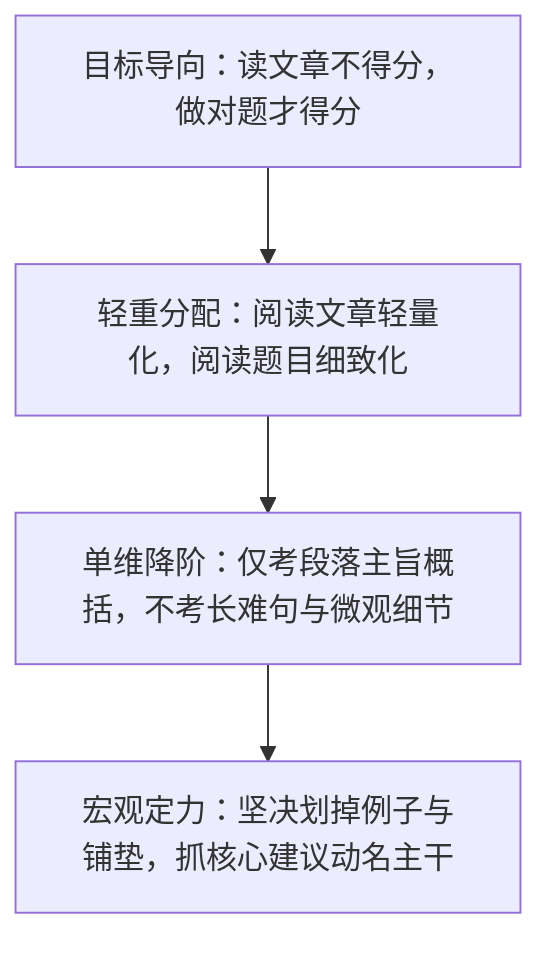
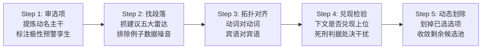

# 考研英语新题型：小标题匹配（Heading Matching）实战全景方法论

> **【定位与加载说明】**  
> 本规范为考研英语二新题型——**小标题匹配（Heading Matching，7 选 5）** 专属方法论与私教带读标准件。  
> 仅在用户发来小标题真题、讲题或错题复盘时按需加载（分支 A-1），彻底与多项对应解耦，极大压缩上下文消耗与 Token 开销。

---

## 一、顶层认知与做题心智模型



1. **“读文章不得分，做对题才得分”**：
   阅读的终极目标是选对小标题。考场上没有任何人会因为你读懂了全段生词而加分。段落中繁杂的案例、背景铺垫与数据细节，**坚决大段大段战略性忽略**，视线只准聚焦于段落建议句与 7 个候选小标题。
2. **“阅读文章轻量化，阅读题目细致化”**：
   段落只看骨架，题目字字推敲。7 个选项必须逐一拆解出【核心及物动词 + 受体名词】，透视正负情感极性与孪生干扰。
3. **单维降阶考法**：
   传统阅读 Part A 是多维高阶考查（微观语法、隐蔽态度、跨段推理）；小标题匹配则是彻头彻尾的**单维降阶考法**——唯一抽离考查“段落大意主旨概括能力”。核心问题只有一个：**“作者写这一段，到底是为了命令/建议读者去干什么？”**
4. **细节服从主旨**：
   小标题是段落的“灵魂宪法”。正确选项必定与全段核心主旨相连。任何仅与段落某个偏僻从句原词重合、但违背全段主旨的选项，一律视为杂质一票否决。

---

## 二、篇章语言学三大底层基石

1. **段落论域天花板与排他独占性（Topic Ceiling）**：
   - 每个段落自确立之日起，便被其主题句设定了严格的**论域天花板**。段落内部一切论述只能在该垂直范畴内展开。
   - 正确小标题对当段具有**唯一独占性**；
   - **外来异物一票否决**：若选项核心概念脱离了该段论域（全段谈沟通，选项冒出“削减预算”），直接击毙；
   - **大而无当一票否决**：若选项抽象到能放入全篇任何一段（如“坚持梦想”），丧失独占区分度，坚决淘汰。
2. **重要信息三特征体系**：
   - 答案源 100% 诞生于重要信息之内：**重要位置（段首总括句、段尾总结句）、重要标志（转折词 However/But、因果词 Thus/Therefore 之后）、重复现象（反复高频提及的中心概念）**。
3. **代词指代锁链与向上咬合追溯**：
   - 代词（*this, that, these, they, it*）严格遵循先行词就近原则；
   - 当段落尾句出现短小抽象的代词总结句时（*When it works, it works great*），若读不懂代词，**立即向紧邻上一句抓取核心主体名词**，该名词即为小标题映射源。

---

## 三、建议指南类说明文的两大底层行文范式

考研英语二绝大多数小标题文章属于**行动指南类说明文（Practical Action Guides）**，严格遵循两大黄金范式：

### 范式 A：欲破后立模型（先铺垫痛点，后转折给建议）—— 极高频！

```
┌────────────────────────────────────────────────────────┐
│ 前 1~3 句：描摹现实痛点 / 常见误区 / 错误尝试 (负极性 -) │
│ “单凭提一次是不够的 / 很多经理误以为这样可行”           │
└──────────────────────────┬─────────────────────────────┘
                           │ 强转折 / 因果词 (However / But / Instead / Thus)
                           ▼
┌────────────────────────────────────────────────────────┐
│ 破局核心句：亮出行动建议 / 纠偏指令 (正极性 + 核心主旨)   │
│ “你必须像销售员一样推销 / 务必倾听各方顾虑”             │
└────────────────────────────────────────────────────────┘
```
- **考场口诀**：**前段痛点倒苦水，转折之后掏解药；解药就是主旨句，动名对齐跑不掉！**
- **致命陷阱**：考生常在第 1 句痛点铺垫中误抓关键词，选中了负极性的干扰项。

### 范式 B：黄金三段论模型（开门见山给建议，后举例展开）

```
┌────────────────────────────────────────────────────────┐
│ 第 1 句：直接亮出总括对策 / 祈使指令 (正极性 + 全段总括)  │
│ “在会议前务必做好充分准备 / 给员工提供灵活工时”         │
└──────────────────────────┬─────────────────────────────┘
                           │ 顺承推进展开
                           ▼
┌────────────────────────────────────────────────────────┐
│ 后续展开：提供实证支撑、列举案例数据、阐述实施好处       │
│ “例如某公司通过调查发现...这样做能提升 20% 效率”       │
└────────────────────────────────────────────────────────┘
```
- **考场口诀**：**开门见山抓首句，举例好处全划去；例子只给观点打工，反客为主必死局！**

---

## 四、建议句与祈使句五大语法定位雷达

视线扫描段落时，开启雷达搜寻以下五类语言信号，信号句即为**核心题眼句**：

| 雷达类型 | 核心标志词与语法形态 | 实战例句形态 | 小标题映射模式 |
| :--- | :--- | :--- | :--- |
| **雷达 1：祈使动词原形** | 句首直接出现动词原形（*Listen, Avoid, Set, Keep, Focus*） | *Focus on high-value tasks first.* | 直出同义祈使句或动名词短语（*Prioritize work*） |
| **雷达 2：强情态动词** | *must, should, need to, have to, ought to* | *You need to understand their hidden concerns.* | 情态动词后的动宾短语直接映射小标题核心 |
| **雷达 3：价值评价句型** | *It is important/vital/crucial/best to do...* | *It is essential to establish clear boundaries.* | *to* 后的不定式动作即为全段小标题 |
| **雷达 4：对策行动词** | *solution, advice, suggestion, step, key is to...* | *The key to success lies in regular practice.* | *lies in* 或 *is to* 后的宾语即为答案 |
| **雷达 5：反向否定戒律** | *Never do, Don't, Stop doing, Rather than...* | *Don't try to solve everything at once.* | 否定表达常映射为正向建议（*Take one step at a time*） |

---

## 五、小标题五步闭环标准流程（SOP）



1. **Step 1：审选项（选项骨架化）**：
   - 快速扫描 A~G 选项，用铅笔圈出【及物动词 + 宾语名词】；
   - 标注情感色彩（+ 建议支持 / − 避免反对）；
   - **孪生选项鉴别预警**：若发现两个选项动词相同但宾语不同（如 *Seek feedback* vs *Seek financial support*），立刻打五角星，必有一真一假！
2. **Step 2：找段落（雷达锁题眼）**：
   - 扫视当前段落，先辨别是“欲破后立”还是“开门见山”；
   - 启动五大建议句雷达，精准圈定 1~2 句题眼建议句；
   - **反向卡位**：坚决划掉段落中间的 *for example*, 人名机构名、数据百分比，对段落物理脱水！
3. **Step 3：拓扑对齐（物理特征对齐）**：
   - 将题眼句的【动作 + 受体】与候选选项进行拓扑对齐；
   - 对齐三法宝：**原词重现（大胆秒选）、同义替换（动名同构）、上位抽象概括**。
4. **Step 4：兑现检验与死刑处决**：
   - 核验下文细节是否在“兑现”该小标题的承诺；
   - 运用死刑判据，将误选项拉入死刑库处决（见第七节）。
5. **Step 5：动态划除**：
   - 选定一个选项立即从 A~G 列表中划掉，候选池每做一题减少一个，题目越做越快、越做越准！

---

## 六、小标题核心死刑判据库（处决 6 大高频干扰项）

解出正确选项只完成 50%，未选的干扰项必须能在脑内出具明确的死刑判决书：

1. **判据九：细节陷入 / 反客为主排除（小标题第一大杀手）**：
   - **法理**：例子是为观点打工的。命题人截取段落末尾例子中的原词（如调查中的具体数字、某个特定案例的人名），包装成小标题。
   - **处决判词**：*“该选项只是段落末尾举例支撑的微观细节，犯了反客为主罪，以偏概全，直接击毙！”*
2. **判据十：论域天花板越界 / 大而无当排除**：
   - **法理**：选项脱离了该段的具体操作范畴，或者抽象到可以放在全文任何一段（如 *Be confident*）。
   - **处决判词**：*“该选项丧失了对本段的排他独占性，大而无当，一票否决！”*
3. **判据一：脱离核心论域 / 外来异物排除**：
   - **法理**：选项的核心名词在段落内零同义替换、零近义改写、零上下义映射，属于外部强行植入的异物。
   - **处决判词**：*“本段全篇讨论时间管理，选项冒出‘企业融资’，外来异物入侵，就地正法！”*
4. **判据三：正负态度反向排除**：
   - **法理**：段落核心是提供正面破局建议（+），选项却截取了段首倒苦水痛点的负面表述（−）。
   - **处决判词**：*“把段首的毒药当成了转折后的解药，正负极性反转，处决！”*
5. **判据十一：孪生选项鉴别失误（偷换宾语 / 偷换动词）**：
   - **法理**：命题人制造两个长相极度相似的孪生选项。动词完全一致，但宾语概念被移花接木。
   - **处决判词**：*“动词虽然对了，但宾语偷梁换柱，典型的孪生套牌车，拉出去枪毙！”*
6. **判据十二：原词重现陷阱排除**：
   - **法理**：孤立照搬段落中某个生僻词，但选项整体动宾搭配与段落建议毫无关系。
   - **处决判词**：*“原词形似而神离，借尸还魂，排除！”*

---

## 七、私教逐题带读七步法与错题“先问后诊”归因

### 1. 私教逐题带读七步流水线（课堂带读规范）
私教面对每一道小标题题，必须按以下七步把解题动作做给学生看：
1. **指出行文范式**：点明段落是“欲破后立”还是“黄金三段论”；
2. **亮出题眼句**：启动五大建议雷达，明确指出第几句是核心建议句；
3. **划掉非考点噪音**：当场指出哪些举例、数据和背景可以战略性忽略，坚决划掉；
4. **动名拓扑对齐**：把题眼句的动作和宾语，与选项逐字对齐，锁定正确选项；
5. **处决最险干扰项**：挑出最容易误选的干扰项，出具死刑判决书；
6. **动态划除选项**：宣告该选项已划掉，同步剩余候选池；
7. **核心动名态度词精讲**：精讲决定做对这道题的核心词汇（融入讲解，**恪守零音标原则**）。

### 2. 错题复盘“先问后诊”归因模型
当学生做错题目时：
1. **发问收尾**：「**你做这道题的时候是怎么想的？为什么选了这个选项？**」，立即停下等学生自述；
2. **精准点穴**：结合学生自述直击思维漏洞：
   - 选了例子里的词 → 点破“细节陷入/反客为主（把打工仔当成了老板）”；
   - 选了段首铺垫的词 → 点破“在毒药堆里选答案（忽视了转折后建议）”；
   - 动词对了但宾语偷换 → 点破“孪生套牌车（未比对受体实体）”；
   - 提炼一句话前瞻策略。

---

## 八、考场应急决策与通关口诀

### 1. 30 秒卡壳应急救生包
- **生词扎堆读不懂**：狂划段中 *for example* 和数据；只抓祈使动词或 *should/need to*；提炼最简单的动词+名词直接对齐选项！
- **转折句读完对不上选项**：破除转折迷信，该转折可能只是局部递进；果断**回退拉回段落第 1 句**，按开门见山总分模型直出匹配！

### 2. 小标题实战通关口诀（七言律绝）
```text
小标题题送温暖，非必要时不读全；
首尾段落定海针，建议指南最常见；
选项先抓动加名，孪生预警记心间；
欲破后立看转折，开门见山抓首联；
祈使情态建议句，好处例子全删完；
原词细节莫贪恋，改写上位选主干；
生词莫慌找代词，逆向质检保满分！
```
