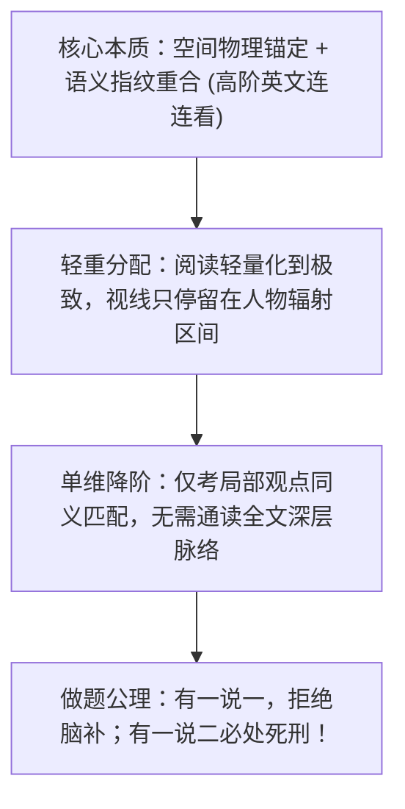

# 考研英语新题型：多项对应（Multiple Matching）极速秒杀方法论

> **【定位与加载说明】**  
> 本规范为考研英语二新题型——**多项对应（Multiple Matching，7 选 5）** 专属方法论与私教带读标准件。  
> 仅在用户发来多项对应真题、讲题或错题复盘时按需加载（分支 A-2），彻底与小标题匹配解耦，极大压缩上下文消耗与 Token 开销。

---

## 一、顶层认知与做题心智模型



1. **“高阶英文连连看”的本质**：
   多项对应题在本质上是**传统阅读细节题的极端单维降阶版本**。考生完全不需要通读全文，不需要理解文章探讨的宏观背景，也不需要探究作者的深层立场；命题人考查的唯一目标是：**“左侧这个人名，在文中到底说了哪句话，与右侧哪个选项同义对应？”**
2. **“读文章不得分，做对题才得分”**：
   严禁通读全文后再做题！文章的大段铺垫、背景介绍、过渡段落全部战略性忽略。视线落于正文时只做两件事：**找人名、找引语**。
3. **“有一说一，拒绝推理；有一说二必错！”**：
   多项对应考查的是言论陈述的忠实映射，而非逻辑推论。原文只说了“他转行搞电气工程”，选项就只能是“转行电气工程”；凡是根据转行脑补出“电气工程前景广阔”、“他具有创新精神”的选项，全部依照过度推理判处死刑！

---

## 二、篇章语言学三大底层基石

1. **空间坐标物理锚定**：
   左侧 41~45 题干的人名、机构名是大写字母构成的天然物理发光体。做题时关闭大脑的发音与中文翻译，开启纯视觉扫描，直接空降定位。
2. **顺文单调递增律与“双向区间夹逼法”**：
   - **首次登场顺文单调递增律**：英语二多项对应题中，各题干人名/专有名词在正文中的**首次出场顺序，100% 严格顺文单调递增**（第 41 题人物首次登场在先，第 42 题人物在后，依序向下排列）。
   - **双向区间夹逼法**：如果某个人名在文中一时找不到，**严禁从头回读**！看上一题人名首次出场在第几段（如 Para 2），看下一题人名首次出场在第几段（如 Para 5），目标人名 100% 蜷缩在 Para 3~4 之间，直接在夹逼区间走 S 型扫描，瞬间破局！
   - **间断交叉复现与全名重启律（Interleaved Reappearance）**：考研英语常涉及多方观点论辩，作者常在引出新人后，**再次以全名重新提及旧人物**进行反驳或追述（如 2011 年 Andrew Lansley 在 Para 2 首现，Stephenson 在 Para 4-5 首现，随后 Lansley 在 Para 6 全名复现并引述发言，紧接着 Stephenson 又在 Para 7-8 全名复现提建议）。
     - **判定规则**：**全名一旦显式复现，立即重启该人物全新的实体链与发言辐射区间**！后文段内的代词（*He / She*）重新向上咬合到该复现全名上。
3. **篇章实体链与代词回溯**：
   人物出场后，后续句子常以代词（*He, She, They*）或身份简称（*the researcher, the economist*）继续发表观点。代词严格向上咬合，构成不可分割的实体链。

---

## 三、人物有效发言辐射区间判定（Boundary Demarcation）

这是多项对应题**最核心的技术分水岭**！命题人最喜欢用“事实履历”充当噪音，用“下一位人物出场”划定边界：

```
┌────────────────────────────────────────────────────────┐
│ 噪音区（跳过）：人物学术头衔、生平履历、研究背景、任职机构 │
│ “Dr. Smith, a senior fellow at Oxford who studied...”   │
└──────────────────────────┬─────────────────────────────┘
                           │ 观点引出标志
                           ▼
┌────────────────────────────────────────────────────────┐
│ ★ 有效发言辐射区（核心）：双引号直接引语 / 间接引述动词   │
│ said, argued, noted, suggested, believed, found that   │
└──────────────────────────┬─────────────────────────────┘
                           │ 终结与重启机制
                           ▼
┌────────────────────────────────────────────────────────┐
│ 终结与重启：新人登场切断当前区间；全名复现重启新发言链！ │
└────────────────────────────────────────────────────────┘
```

- **四大辐射标志与边界规则**：
  1. **直接引语**：双引号 `“...”` 内的内容是最高确定性的核心答案源；
  2. **间接引述动词**：*said, argued, suggested, claimed, found, pointed out that...*
  3. **实体代词延续**：紧随其后的 *He added that... / She further warned that...* 仍属于该人物观点；
  4. **终结与重启铁律**：**单次发言区间内，新人全名一出，旧人当前发言切断！** 绝不向后越界阅读；但若后文该旧人全名再次显式复现，则代表开启该旧人的新一轮发言区间。

---

## 四、多项对应 5 分钟全对标准 SOP

```mermaid
gantt
    title 多项对应题 5 分钟极速实战甘特图 (00:00 - 05:00)
    dateFormat  ss
    axisFormat  %M:%S
    section 预处理阶段
    题干代码化 (41~45 抓大写缩写)     :active, s1, 00, 20s
    选项骨架化 (A~G 提动名主干与孪生)  :crit, s2, 20, 60s
    section 顺流连连看
    顺流寻人与区间定位 (41~43题)     :s3, 80, 100s
    中后程顺流夹逼与匹配 (44~45题)   :s4, 180, 80s
    section 动态划除
    划除已选选项并秒杀剩余            :s5, 260, 40s
```



1. **Step 1：题干代码化（20 秒）**：
   - 扫视 41~45 题干人名，提炼大写简称代码（如 *Nicholas M. Butler → NMB*, *Thomas Carlyle → TC*），脑内建立物理坐标。
2. **Step 2：选项骨架化与孪生预警（60 秒）**：
   - 快速拆解 A~G 选项，画出【核心动词 + 宾语名词】；
   - **孪生选项鉴别机制**：
     - 若发现选项 A 与 C 动词相同（如都是 *encourage*），但 A 的宾语是 *internal collaboration*，C 的宾语是 *external competition*，立刻打星标！这属于命题人预设的**顶级区分点**，回文专门比对宾语即可瞬间斩杀干扰项！
3. **Step 3：顺流寻人与区间划定（100 秒）**：
   - 顺文蛇形扫描，空降锁定第 41 题人名；
   - 划定有效言论辐射区间，剔除生平与头衔。
4. **Step 4：提取语义指纹，连连看锁定**：
   - 提取人物发言核心句的【动作 + 宾语】；
   - 在选项池中比对 2~3 个特征实词或同义替换，有一说一，直接物理连线锁定答案。
5. **Step 5：动态划除与候选池收敛**：
   - 选定一项立即划掉，后程题目选项越来越少，越做越快！

---

## 五、多项对应核心死刑判据库（处决 6 大高频干扰项）

解题完毕后，必须对未选的干扰项出具死刑判决书：

1. **判据四：主体混淆 / 张冠李戴排除（多项对应第一大杀手）**：
   - **法理**：选项所描述的观点完全来自原文，但那是上一段人名或下一段人名说的，硬生生安在了当前人物头上。
   - **处决判词**：*“观点虽属实，但发言主体犯了张冠李戴罪，跨越了人物辐射边界，直接击毙！”*
2. **判据七：过度推理 / 脑补引申排除（多项对应第二大杀手）**：
   - **法理**：考生凭生活常识或中文语感，顺理成章地替人物脑补出深层含义（“有一说二”）。
   - **处决判词**：*“原文只提到事实，选项擅自引申宏观价值，过度推理，判处死刑！”*
3. **判据十一：孪生选项鉴别失误（动词对但宾语偷换）**：
   - **法理**：动词与原文引述完全重合，但及物动词后面的受体名词被移花接木。
   - **处决判词**：*“孪生套牌干扰项，宾语实体发生偷梁换柱，就地正法！”*
4. **判据六：偷换概念 / 局部词形嫁接排除**：
   - **法理**：拼凑该人物发言中的零散单词，但重新组合后的谓语动词或修饰语完全违背原文逻辑。
   - **处决判词**：*“剪刀加浆糊拼凑伪证，偷换主干概念，排除！”*
5. **判据一：脱离核心论域 / 无对应内容排除**：
   - **法理**：选项核心实体在当前人物发言区间内零存在、零同义替换。
   - **处决判词**：*“外来异物入侵，全域灭活，一票否决！”*
6. **判据五：因果倒置 / 时序颠倒排除**：
   - **法理**：将人物表述的原因当成了推导的结果。
   - **处决判词**：*“因果颠倒，逻辑方向看反，处决！”*

---

## 六、多项对应两大进阶实战形态

### 1. 零发言 / 第三人称被评述人物立场反推（Indirect / Reflected Stance）
- **命题特征**：题干常带有 `seemed to believe that`，或某位备考人物在正文中**从始至终未直接开口**（无直接引语、无主动引述动词），而是作为案例或批判靶子出现在他人发言中（典型如 2011 年 Q43 明星厨师 Jamie Oliver，出现在 Andrew Lansley 的批评中：`criticised Jamie Oliver's attempt to improve school lunches as an example of how 'lecturing' was not the best way`）。
- **解题法宝**：**反向卡位与态度极性反转**！批评者说“说教不是改变行为的好办法（not the best way）”，反推被批评者（Jamie Oliver）必定认为“说教是改善校餐的有效办法（an effective way）”。这是多项对应中唯一合法的一阶逆向逻辑映射。

### 2. 群体背景造势 vs 个人立此存照（Group vs Individual Claim）
- **命题特征**：文章开头或过渡段常有群体概括诉求（如 `Leading doctors demand...`, `Senior medical figures want to...`），后文具体编号人物也有类似呼吁。
- **解题法宝**：**群体是背景墙，个人才是立此存照**！多项对应考查的是 41~45 具体编号个体的言论认领。若某项诉求在群体段落与个人发言中均有重合，答案必须死死锚定在个人亲自领衔的动宾短语上（如 `He also urged councils to impose...`）。无个体引述动词认领的纯群体宏观诉求，通常是命题人设置的张冠李戴陪葬陷阱（如 2011 年首段关于脂肪税与香烟警告的群体呼吁）。

---

## 七、私教逐题带读七步法与错题“先问后诊”归因

### 1. 私教逐题带读七步流水线（连连看教学流）
每讲一道多项对应题，私教必须按以下七步现场演示：
1. **空间坐标物理锚定**：指出人名大写发光点，展示空降定位；若遇漏找演示双向区间夹逼；
2. **划定言论辐射区间**：圈出双引号或引述动词，当场剔除该人物生平头衔，指明“新人登场旧人完结”；
3. **提取言论动名主干与极性**：忽略从属修饰，亮出发言的核心【动作 + 宾语】；
4. **比对语义指纹连连看**：展示原文关键词与选项的同义替换映射，有一说一直接连线；
5. **处决孪生与张冠李戴干扰项**：重点抓出长相相似的孪生选项，出具死刑判决书；
6. **动态划除选项**：更新剩余候选池；
7. **核心动名态度词精讲**：讲透核心词汇（融入讲解，**恪守零音标原则**）。

### 2. 错题复盘“先问后诊”归因模型
当学生做错题目时：
1. **发问收尾**：「**你做这道题的时候是怎么想的？为什么选了这个选项？**」，立即停下等自述；
2. **精准点穴**：
   - 选了别的人物的观点 → 诊断为“张冠李戴 / 主体越界”；
   - 凭常识脑补了深层含义 → 诊断为“过度推理（有一说二必死）”；
   - 动词看对了但宾语看漏了 → 诊断为“孪生套牌车未做宾语核验”；
   - 提炼一句话前瞻教训。

---

## 八、考场应急决策与通关口诀

### 1. 30 秒卡壳应急救生包
- **顺文寻人断层（人名找不到了）**：坚决不从头重读！看上一题人名在第几段，下一题在第几段，锁定夹逼区间走 S 型蛇形扫描大写字母与代词 *He / She*！
- **选项语义极其接近二选一纠结**：启动**“孪生选项终极鉴别”**——把两个选项并排，遮住相同的动词，仅比对后面的宾语名词！看原文人物发言到底涉及了哪个宾语实体，1 秒破局！

### 2. 多项对应 5 分钟秒杀口诀（七言律绝）
```text
多项对应送分田，五到八分把分捡；
题干人名提代码，选项先画动和连；
顺文寻人蛇形走，漏人夹逼两段间；
三段之内必发言，新人一出旧人完；
引述动词双引号，事实履历全靠边；
动宾同义仔细对，动态划除保全圈！
```
